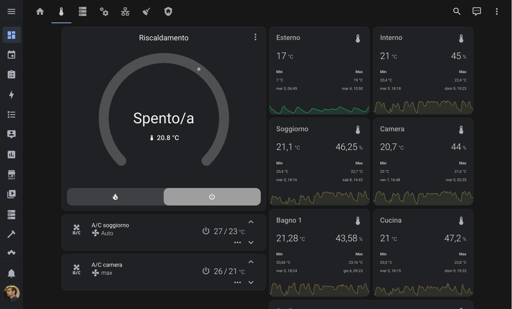
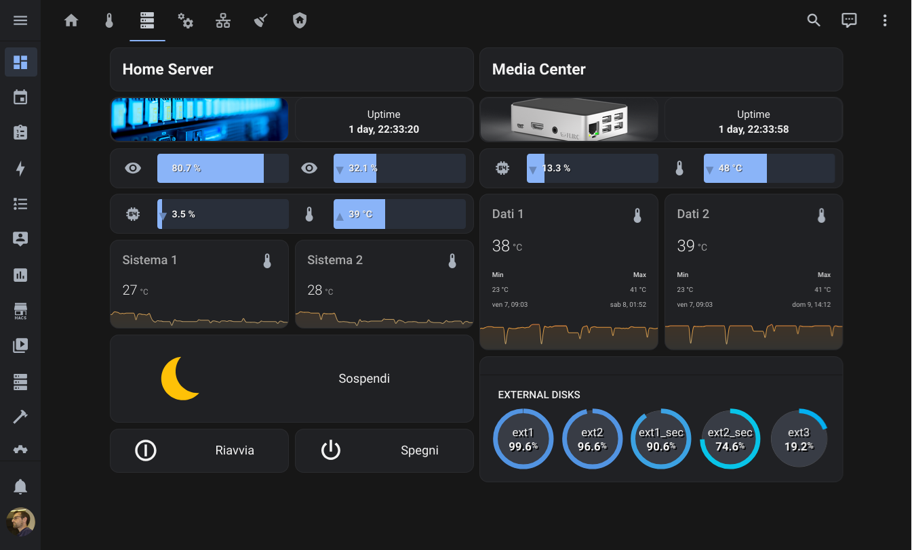
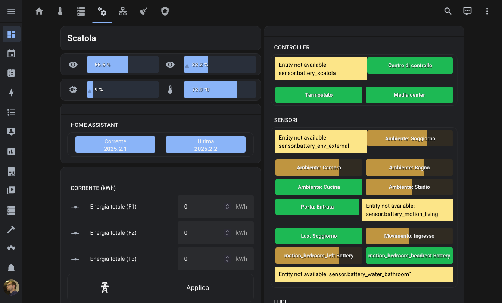

# My Home Assistant configuration

This is a mirror of my home automation configuration for Home Assistant.
It's been stripped down of some templates for speech and notifications.

## What's a Smart Home for me

My key principles for home automation are:

* Home automation should not get in the way of living my place naturally
* My place should know what I need before I do something about it
* Any automation or behavior should be overridable if needed
* Use only open source or flashable hardware
* My place should continue to work without Internet connection
* Use cloud services only when absolutely necessary

I'm always hungry for new ideas about automations, integrations and hardware.
You may visit [my Home Assistant forum thread](https://community.home-assistant.io/t/daniele-athome-my-home-assistant-configuration/181754)
if you want to contact me or need help understanding or using any part of my configuration.

## Smart Home diagram

TODO some nice diagram with draw.io maybe

## Hardware used

* An unused 2012 laptop running Home Assistant and Rhasspy
* ConBee II ZigBee USB controller attached to the laptop
* Raspberry Pi 3B+ running Kodi
* A cheap Android tablet as my control center
* Google Home (used only as speaker)
* Sonoff Basic flashed with Tasmota
* Shelly One flashed with Tasmota
* ZigBee Aqara temperature sensors
* ZigBee Aqara motion sensor
* ZigBee Aqara door sensor
* ZigBee RGB LED strips

TODO also include a wishlist or planning to buy

## Lovelace interface

I view this mainly from my tablet hanging on a wall. I had to take some measures
to make it work on the tablet because a complex web application like Lovelace
really needs computing power and memory (did I say it's a cheap tablet?).
A few tricks to keep it fast:

* Don't use a background image
* Don't use animated icons
* Don't put too many cards on a view

I tried pretty much every browser on the tablet and the fastest seems to be Chrome.

My views are pretty tailored to my tablet display: I made them so all content
would fit and I wouldn't need to scroll up and down.

### Main view/Home

### Environment/HVAC

### System monitor

### Home automation devices

### Security

## Software setup

All software is installed through handcrafted Ansible recipes. Home Assistant runs on
Debian GNU/Linux using a virtualenv.

## Packages

Organizing Home Assistant configuration is **hard**. Really, when the number of
automations and sensors starts growing, organizing everything becomes a bit like
doing architecture design for a piece of software. So, if you have any idea you'd
like to share about that, feel free to write to me on the Home Assistant forum.

### Assistant

Meet **Karen**, my voice assistant made with [Rhasspy](https://github.com/rhasspy).
Everything is done through MQTT using the [Hermes protocol](https://docs.snips.ai/reference/hermes).
I built a somewhat primitive implementation of "skills" that do something and speak
some reply. What my voice commands can do:

* say date or time
* get weather/environment information (temperature, some forecasts)
* play some music from my media center
* start a countdown
* commute traffic information
* good morning/good night with some useful actions for morning and night

There is some dialogue support provided by a few AppDaemon apps but it requires
patching Rhasspy 2.5 (pull requests pending). Anyway Rhasspy 2.5 is still in a very
alpha stage. In time, I hope those "skills" could contribute to a framework that would
simplify the implementation.

I use my own wake word &mdash; trained on my own dataset &mdash; and a
ReSpeaker microphone array to listen for voice commands. Speech recognition is
possible with Google Speech-to-text API. I might publish my Rhasspy configuration
one day.

Speech templates for Karen lives in a specific directory that I won't publish.
To introduce some sense of "nuisance" in Karen, I created multiple versions for
each type of sentence to be spoken. Templates are used by the Assistant Speak app
in `apps/assistant_speak.py`.

### Calendar

Just a few calendar sensor. Nothing really useful by itself, it's just data
used by other automations elsewhere.

### Devices

Definitions for some smart devices and device trackers, including phones. It
also includes some automations for notifying about low battery levels.

### Environment

House environment sensors (temperature, humidity) and an automation that alerts
me if the house is on fire :fire:

### Firmware

Firmware update notifications.

### House mode

Configuration data and some automations for what I call the *house mode*. Basically it's the current state of my home.
Each state represents specific behaviors that my place will have, automations to be enabled, stuff to turn on and off,
and so on. The house mode input_select is used throughout the packages.

### HVAC

Integration with [my homemade thermostat](https://github.com/daniele-athome/thermorasp-docs).

### Lights

Some smart light entities and a few scenes that are used in automations elsewhere.

### Media Player

Some fun with my media players:

* Kodi on a Raspberry PI
* Philips TV set
* Google Home (used only for Karen's voice)

It contains mainly utility scripts for handling those players and a few sensors
that help some automations elsewhere.

### Night mode

A *house mode* for the night. It is an environment state where:

* all lights are off
* all media players are off
* my media server is suspended
* no assistant warnings are fired unless it's an emergency
* I'm sleeping :)

Night mode can be triggered manually by saying goodnight to Karen. Otherwise, starting 23:00, Home Assistant will check every minute that:

* all lights are off
* all media players are off
* no motion but in bedroom
* no light everywhere
* my phone is charging
* my notebook is turned off or idle

Those are my very personal conditions for which I can be declared sleeping or going to sleep.
If all those conditions are met, Home Assistant will start a 3 minutes timer and send a push notification to my phone warning me that night mode is about to be activated.
The notification will have 3 actions:

1. Snooze: delay night mode for 15 minutes (after 12 minutes another notification will be sent)
2. Enable now: enable night mode immediately
3. Cancel: disable night mode for tonight

If no action is taken, night mode will be enabled automatically after the timer expires.

### Other

I didn't know where else to put these.

### Persons

Known people living at my place (just me for now).

### Presence

I use a combination of sources to determine my presence:

* Network (nmap integration)
* Bluetooth using [monitor](https://github.com/andrewjfreyer/monitor/)
* GPS using [GPSLogger](https://gpslogger.app/)

When my entrance door opens, some lights are turned on if needed and a presence
arrival scan is initiated. When my phone is detected, Karen greets me and tells
me some information about the house. Also, the alarm system is disarmed.

When I leave, a deperture scan is initiated. When my phone is no longer detected,
lights and any media player are turned off. The alarm system is armed.

Since both automations are triggered by the entrance door sensor, I use a
combination of conditions to distinguish between arrival and departure.

During the night, a motion sensor will turn on a LED strip with a mild light
to help me moving through the living room.

### Scenarios

A few nice automations here. Not all lights are under Home Assistant control yet
though.

Most scenarios are for my living room, since is the room where most of my home
automation hardware is installed at the moment.

When I watch something, all lights are turned off &mdash; I call this *cinema mode*.
A LED strip facing my ceiling is gently turned on when I pause.

Cinema mode is suspended if I ask Karen to keep some lights on &mdash; very useful
when I'm watching something while eating &mdash; I do that a lot :spaghetti:

Controlled lights are turned off automatically when too much light is detected in
the room.

I try to keep room-related configuration in their respective `scenario_<room>.yaml`
files.

#### Guest mode

I need to improve this, but mainly it does something when I tell Karen that I have
guests:

* set a specific light scene
* put some ambient playlist on ([ThePianoGuys](https://www.youtube.com/channel/UCmKurapML4BF9Bjtj4RbvXw)!!)
* Karen won't speak unless it's an emergency

### Security

My home-made security system, based on a webcam and a few other sensors. Tightly
integrated with presence information, my alarm system is armed when I leave
and is disarmed when I'm back. No need to think about it, ever.

### System

My system is made up of a few running machines. This is a how a keep an eye on
them. Heavy use of [Glances](https://github.com/nicolargo/glances/).

### Theme control

Just an automation for setting my preferred theme on startup:
[Google Dark Theme](https://github.com/JuanMTech/google_dark_theme) by
[@JuanMTech](https://github.com/JuanMTech).

### Weather

Some sensors for weather information in my area.

### Zones

Home and work :-)

## AppDaemon

I use AppDaemon mainly for my assistant. Basic question-answer skills are handled
directly in Home Assistant, but more complex stuff required some coding, so I've
implemented a few apps for those.  
Since I use Rhasspy, I've been developing a Hermes plugin for AppDaemon which
I will contribute when it will reach a mature state.

## Acknowledgements

Many people helped me through this, either by sharing their own configurations
or by replying to my calls for help on the Home Assistant forum. **Publishing my
work is a way to thank those people and to give back to this great community.**

## Copyright

  
This work is licensed under a <a rel="license" href="http://creativecommons.org/licenses/by/4.0/">Creative Commons Attribution 4.0 International License</a>.
